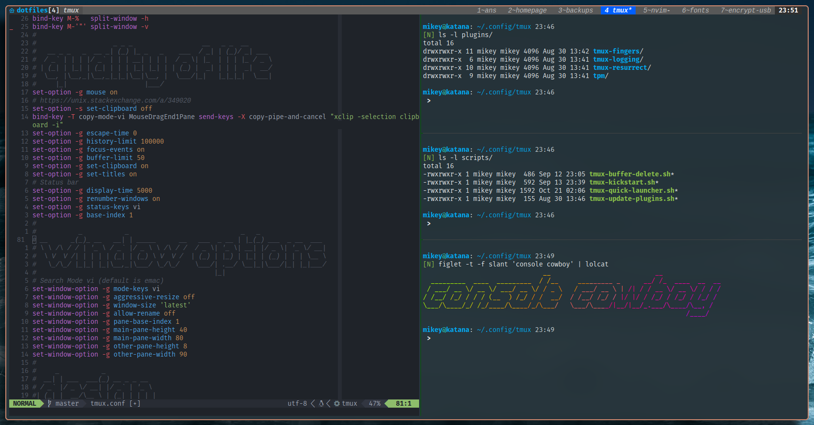

## Tmux Configuration

\

Contains configuration and supporting scripts for `tmux`. Tested and working on 
MacOSX and Linux with Tmux v3.1+

### Installation

**Requirements:**

- `tmux`
- `git`
- `gawk` (for [tmux-fingers][fingers])

```bash
git clone https://github.com/gikeymarcia/tmux-config.git ~/.config/tmux
~/.config/tmux/scripts/tmux-kickstart.sh

# highly recommended add to your .bashrc/.zshrc
alias t=~/.config/tmux/scripts/tmux-quick-launcher.sh
```

The above installs this tmux config ([plugins][tpm] included!) at
`~/.config/tmux/`. If a config is found at '~/.tmux.conf' it is moved to
'~/.tmux.conf.bak'.


### Features

- vim-based remaps with stylized status bar up top
- `<C-a>` is the prefix key
- reload `tmux.conf` with prefix `R`
- alt+vim directions (`h j k l`) to change panes
- new splits & windows created with `c % "` are at current working directory
    - Prefix alt-`c % "` to use default pane opening rules
- copy mode uses vim keys
- `tmux-quick-launcher.sh` to easily change/create sessions (requires `fzf`)
- Prefix `F` for quick select [tmux-fingers][fingers]
- Prefix `<C-s>` to save your session
- Prefix `<C-r>` to reload your session

[tpm]: <https://github.com/tmux-plugins/tpm>
"TPM: The Tmux Plugin Manager"
[fingers]: <https://github.com/Morantron/tmux-fingers>
"Tmux Fingers"
